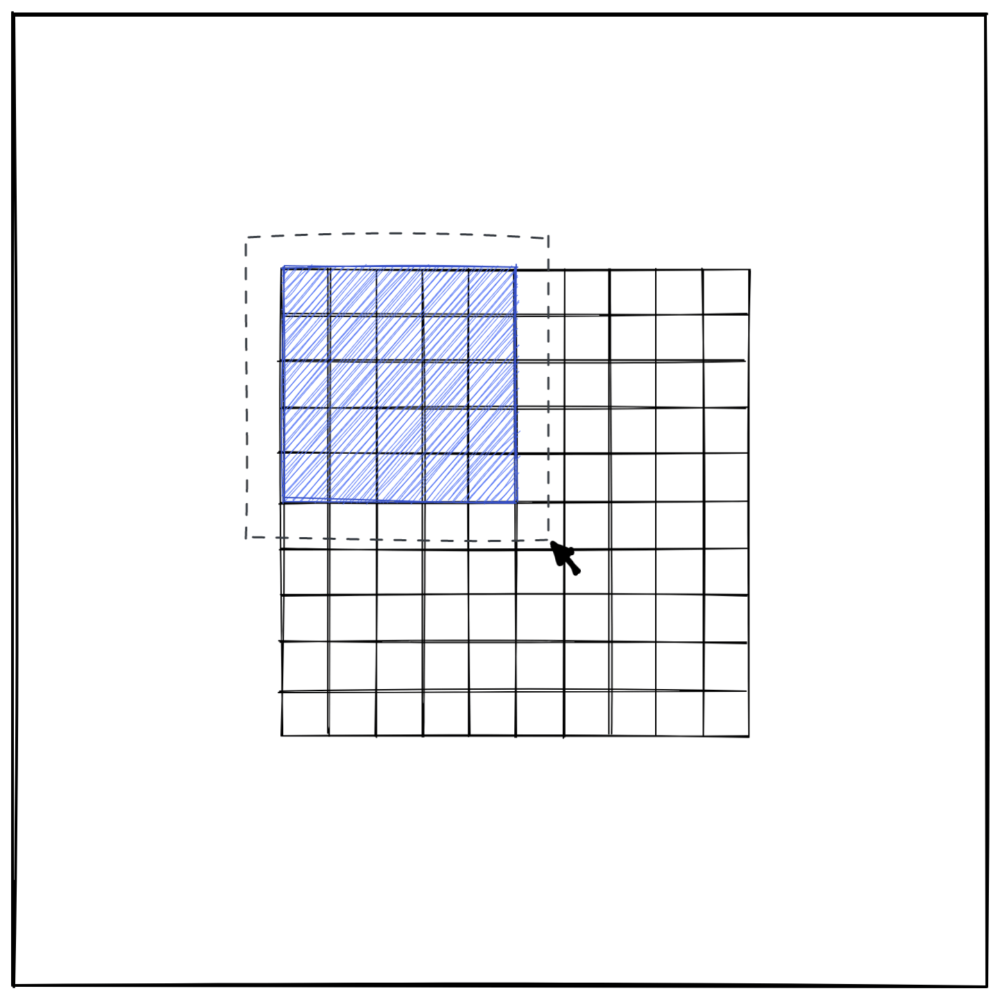

# A simple item selection App

This App selects a group of cells by clicking on areas that needs to be selected.

## User can be able to

- Cell is selected if it is completely within the bounding box
- Selected cells should be highlighted blue
- Cells should remain selected on releasing the mouse
- All cells should be unselected if the user starts dragging to create a new bounding box
- User can start dragging to create a bounding box from anywhere on the page

## Links

- Live Site url: [click here]()

## Built with

- Mobile-first workflow
- HTML
- CSS
- JavaScript
- [React.js](https://reactjs.org/) - JS library

## Author

- Twitter - [@ayibadoubara](https://www.twitter.com/ayibadoubara)

## Acknowledgments

Thanks to [@Dhevine_0X](https://www.twitter.com/Dhevine_0X)
for reviews and readme update on this project.
